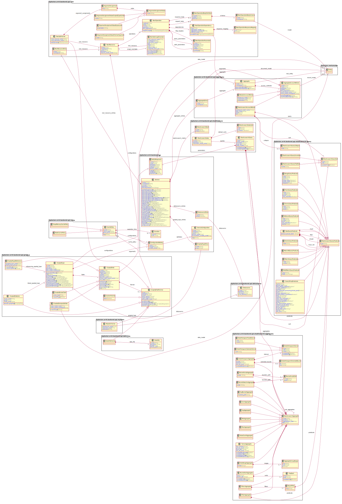

# Laplacian Core

### Model overview

The following diagram explains the entities included in this module.

### Entity list
- [**Entity**](<./doc/entities/Entity.md>)
An entity describing a entity.
- [**Property**](<./doc/entities/Property.md>)
An entity describing a property.
- [**PropertyMapping**](<./doc/entities/PropertyMapping.md>)
An entity describing a property_mapping.
- [**Query**](<./doc/entities/Query.md>)
The queries from which all navigation originates.

- [**Relationship**](<./doc/entities/Relationship.md>)
An entity describing a relationship.
- [**ValueDomain**](<./doc/entities/ValueDomain.md>)
An entity describing a value_domain.
- [**ValueDomainType**](<./doc/entities/ValueDomainType.md>)
An entity describing a value_domain_type.
- [**ValueItem**](<./doc/entities/ValueItem.md>)
An entity describing a value_item.
- [**AggregateAccessMethod**](<./doc/entities/AggregateAccessMethod.md>)
An entity describing a aggregate_access_method.
- [**AggregateEntry**](<./doc/entities/AggregateEntry.md>)
An entity describing a aggregate_entry.
- [**Aggregate**](<./doc/entities/Aggregate.md>)
An entity describing a aggregate.
- [**ElasticsearchAccessMethod**](<./doc/entities/ElasticsearchAccessMethod.md>)
An entity describing a elasticsearch_access_method.
- [**MybatisAccessMethod**](<./doc/entities/MybatisAccessMethod.md>)
An entity describing a mybatis_access_method.
- [**ApiCallArgument**](<./doc/entities/ApiCallArgument.md>)
An entity describing a api_call_argument.
- [**CachePolicy**](<./doc/entities/CachePolicy.md>)
An entity describing a cache_policy.
- [**HeapMemoryCachePolicy**](<./doc/entities/HeapMemoryCachePolicy.md>)
An entity describing a heap_memory_cache_policy.
- [**RedisCachePolicy**](<./doc/entities/RedisCachePolicy.md>)
An entity describing a redis_cache_policy.
- [**DataFileFetcher**](<./doc/entities/DataFileFetcher.md>)
A graphql field fetcher retrieving the value from a file located in the container.

- [**DataFile**](<./doc/entities/DataFile.md>)
An entity describing a data_file.
- [**Datasource**](<./doc/entities/Datasource.md>)
A *DataSource* represents an interface through which a client application access to a data store.
This includes the following models.
- The entity that the datastore exposes to the client
- Statement issued by the client to the datastore

- [**Duration**](<./doc/entities/Duration.md>)
An entity describing a duration.
- [**AvgBucketAggregate**](<./doc/entities/AvgBucketAggregate.md>)
An entity describing a avg_bucket_aggregate.
- [**BucketScriptAggregate**](<./doc/entities/BucketScriptAggregate.md>)
An entity describing a bucket_script_aggregate.
- [**BucketScriptPath**](<./doc/entities/BucketScriptPath.md>)
An entity describing a bucket_script_path.
- [**BucketSelectorAggregate**](<./doc/entities/BucketSelectorAggregate.md>)
An entity describing a bucket_selector_aggregate.
- [**BucketSortAggregate**](<./doc/entities/BucketSortAggregate.md>)
An entity describing a bucket_sort_aggregate.
- [**FieldSort**](<./doc/entities/FieldSort.md>)
An entity describing a field_sort.
- [**DateHistogramAggregate**](<./doc/entities/DateHistogramAggregate.md>)
An entity describing a date_histogram_aggregate.
- [**DateHistogramExtendedBounds**](<./doc/entities/DateHistogramExtendedBounds.md>)
An entity describing a date_histogram_extended_bounds.
- [**DateHistogramInterval**](<./doc/entities/DateHistogramInterval.md>)
An entity describing a date_histogram_interval.
- [**DateHistogramCalendarInterval**](<./doc/entities/DateHistogramCalendarInterval.md>)
An entity describing a date_histogram_calendar_interval.
- [**DateHistogramFixedInterval**](<./doc/entities/DateHistogramFixedInterval.md>)
An entity describing a date_histogram_fixed_interval.
- [**DateRangeAggregate**](<./doc/entities/DateRangeAggregate.md>)
An entity describing a date_range_aggregate.
- [**AggregateGroupRange**](<./doc/entities/AggregateGroupRange.md>)
An entity describing a aggregate_group_range.
- [**FilterAggregate**](<./doc/entities/FilterAggregate.md>)
An entity describing a filter_aggregate.
- [**FiltersAggregate**](<./doc/entities/FiltersAggregate.md>)
An entity describing a filters_aggregate.
- [**KeyedFilter**](<./doc/entities/KeyedFilter.md>)
An entity describing a keyed_filter.
- [**SumAggregate**](<./doc/entities/SumAggregate.md>)
An entity describing a sum_aggregate.
- [**AvgAggregate**](<./doc/entities/AvgAggregate.md>)
An entity describing a avg_aggregate.
- [**MinAggregate**](<./doc/entities/MinAggregate.md>)
An entity describing a min_aggregate.
- [**MaxAggregate**](<./doc/entities/MaxAggregate.md>)
An entity describing a max_aggregate.
- [**ValueCountAggregate**](<./doc/entities/ValueCountAggregate.md>)
An entity describing a value_count_aggregate.
- [**TermsAggregate**](<./doc/entities/TermsAggregate.md>)
A multi-bucket value source based aggregation where buckets are dynamically built
- one per unique value.

- [**ElasticsearchClient**](<./doc/entities/ElasticsearchClient.md>)
An entity describing a elasticsearch_client.
- [**ElasticsearchAggregate**](<./doc/entities/ElasticsearchAggregate.md>)
An entity describing a elasticsearch_aggregate.
- [**ElasticsearchIndex**](<./doc/entities/ElasticsearchIndex.md>)
An entity describing a elasticsearch_index.
- [**ElasticsearchIndexSort**](<./doc/entities/ElasticsearchIndexSort.md>)
An entity describing a elasticsearch_index_sort.
- [**ElasticsearchQueryCollapse**](<./doc/entities/ElasticsearchQueryCollapse.md>)
An entity describing a elasticsearch_query_collapse.
- [**ElasticsearchQueryPredicate**](<./doc/entities/ElasticsearchQueryPredicate.md>)
An entity describing a elasticsearch_query_predicate.
- [**ElasticsearchQuerySort**](<./doc/entities/ElasticsearchQuerySort.md>)
An entity describing a elasticsearch_query_sort.
- [**ElasticsearchQueryScoreSort**](<./doc/entities/ElasticsearchQueryScoreSort.md>)
An entity describing a elasticsearch_query_score_sort.
- [**ElasticsearchQueryFieldSort**](<./doc/entities/ElasticsearchQueryFieldSort.md>)
An entity describing a elasticsearch_query_field_sort.
- [**ElasticsearchQuery**](<./doc/entities/ElasticsearchQuery.md>)
An entity describing a elasticsearch_query.
- [**BoolQueryPredicate**](<./doc/entities/BoolQueryPredicate.md>)
An entity describing a bool_query_predicate.
- [**ExistsQueryPredicate**](<./doc/entities/ExistsQueryPredicate.md>)
An entity describing a exists_query_predicate.
- [**MatchAllQueryPredicate**](<./doc/entities/MatchAllQueryPredicate.md>)
An entity describing a match_all_query_predicate.
- [**MatchQueryPredicate**](<./doc/entities/MatchQueryPredicate.md>)
An entity describing a match_query_predicate.
- [**MultiMatchQueryPredicate**](<./doc/entities/MultiMatchQueryPredicate.md>)
An entity describing a multi_match_query_predicate.
- [**QueryStringPredicate**](<./doc/entities/QueryStringPredicate.md>)
An entity describing a query_string_predicate.
- [**RangeQueryPredicate**](<./doc/entities/RangeQueryPredicate.md>)
An entity describing a range_query_predicate.
- [**TermQueryPredicate**](<./doc/entities/TermQueryPredicate.md>)
An entity describing a term_query_predicate.
- [**TermsQueryPredicate**](<./doc/entities/TermsQueryPredicate.md>)
An entity describing a terms_query_predicate.
- [**WildcardQueryPredicate**](<./doc/entities/WildcardQueryPredicate.md>)
The wildcard search query. Supported wildcards are *, which matches any character sequence
(including the empty one), and ?, which matches any single character. Note this query can be slow,
as it needs to iterate over many terms. In order to prevent extremely slow WildcardQueries,
a Wildcard term should not start with one of the wildcards * or ?.
(The wildcard field type however, is optimized for leading wildcards)

- [**CustomFetcher**](<./doc/entities/CustomFetcher.md>)
An entity describing a custom_fetcher.
- [**GraphqlFieldFetcher**](<./doc/entities/GraphqlFieldFetcher.md>)
An entity describing a graphql_field_fetcher.
- [**GraphqlFieldLink**](<./doc/entities/GraphqlFieldLink.md>)
An entity describing a graphql_field_link.
- [**GraphqlCompositeField**](<./doc/entities/GraphqlCompositeField.md>)
An entity describing a graphql_composite_field.
- [**GraphqlField**](<./doc/entities/GraphqlField.md>)
An entity describing a graphql_field.
- [**GraphqlScalarField**](<./doc/entities/GraphqlScalarField.md>)
An entity describing a graphql_scalar_field.
- [**GraphqlTypeReference**](<./doc/entities/GraphqlTypeReference.md>)
An entity describing a graphql_type_reference.
- [**GraphqlType**](<./doc/entities/GraphqlType.md>)
An entity describing a graphql_type.
- [**MybatisFetcher**](<./doc/entities/MybatisFetcher.md>)
An entity describing a mybatis_fetcher.
- [**RestApiFetcher**](<./doc/entities/RestApiFetcher.md>)
An entity describing a rest_api_fetcher.
- [**ArgumentAssignment**](<./doc/entities/ArgumentAssignment.md>)
An entity describing a argument_assignment.
- [**ArgumentAssignmentValue**](<./doc/entities/ArgumentAssignmentValue.md>)
An entity describing a argument_assignment_value.
- [**ArgumentAssignmentValueFetcherArgument**](<./doc/entities/ArgumentAssignmentValueFetcherArgument.md>)
An entity describing a argument_assignment_value_fetcher_argument.
- [**ArgumentAssignmentValueGraphqlTypeConfig**](<./doc/entities/ArgumentAssignmentValueGraphqlTypeConfig.md>)
An entity describing a argument_assignment_value_graphql_type_config.
- [**ArgumentAssignmentValueExpression**](<./doc/entities/ArgumentAssignmentValueExpression.md>)
An entity describing a argument_assignment_value_expression.
- [**RestApiUsageExample**](<./doc/entities/RestApiUsageExample.md>)
An entity describing a rest_api_usage_example.
- [**RestOperationParameter**](<./doc/entities/RestOperationParameter.md>)
An entity describing a rest_operation_parameter.
- [**RestOperation**](<./doc/entities/RestOperation.md>)
An entity describing a rest_operation.
- [**RestOperationBodyDefinition**](<./doc/entities/RestOperationBodyDefinition.md>)
An entity describing a rest_operation_body_definition.
- [**RestOperationBodySchema**](<./doc/entities/RestOperationBodySchema.md>)
An entity describing a rest_operation_body_schema.
- [**RestOperationDependency**](<./doc/entities/RestOperationDependency.md>)
An entity describing a rest_operation_dependency.
- [**RestOperationResponseMapping**](<./doc/entities/RestOperationResponseMapping.md>)
An entity describing a rest_operation_response_mapping.
- [**RestResourceEntry**](<./doc/entities/RestResourceEntry.md>)
An entity describing a rest_resource_entry.
- [**RestResource**](<./doc/entities/RestResource.md>)
An entity describing a rest_resource.
- [**Service**](<./doc/entities/Service.md>)
An entity describing a service.
- [**DatasourceEntry**](<./doc/entities/DatasourceEntry.md>)
An entity describing a datasource_entry.
- [**GraphqlTypeEntry**](<./doc/entities/GraphqlTypeEntry.md>)
An entity describing a graphql_type_entry.
- [**ServiceConfiguration**](<./doc/entities/ServiceConfiguration.md>)
An entity describing a service_configuration.
- [**ConfigurationBinding**](<./doc/entities/ConfigurationBinding.md>)
An entity describing a configuration_binding.

 -->